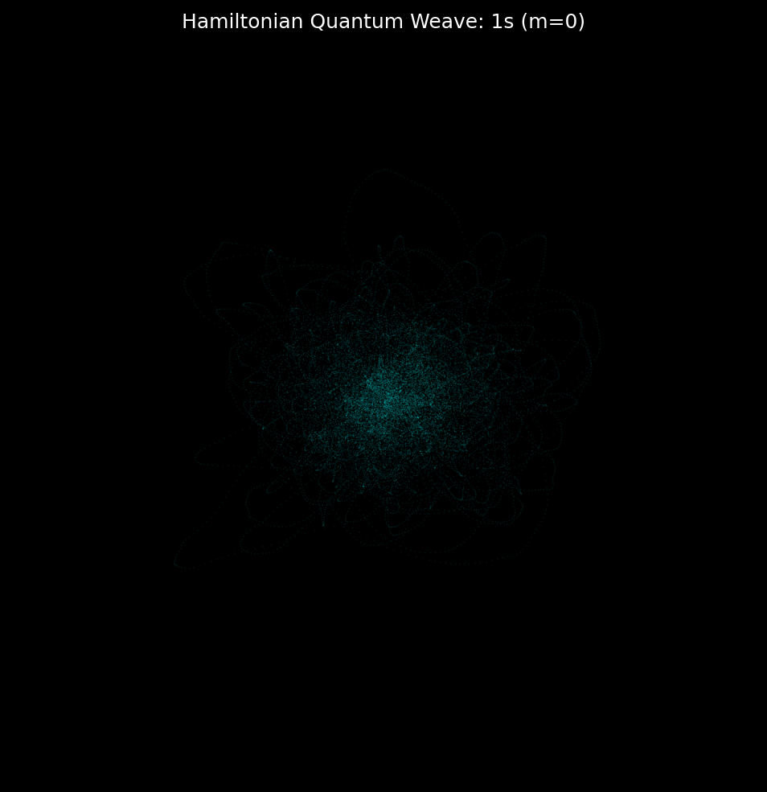
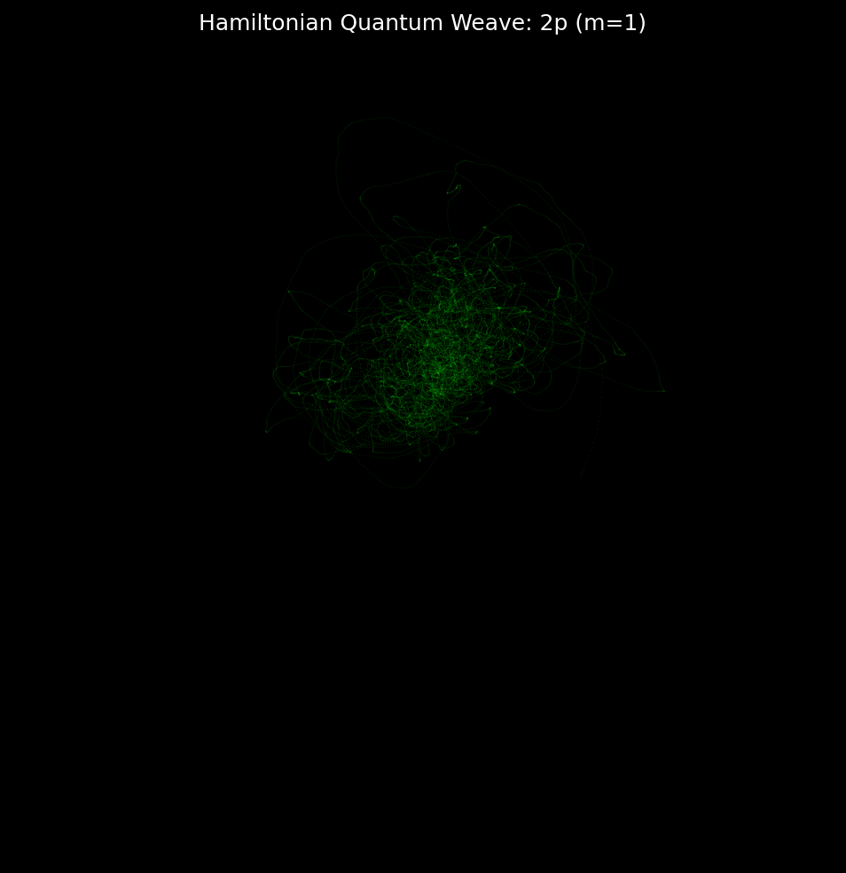
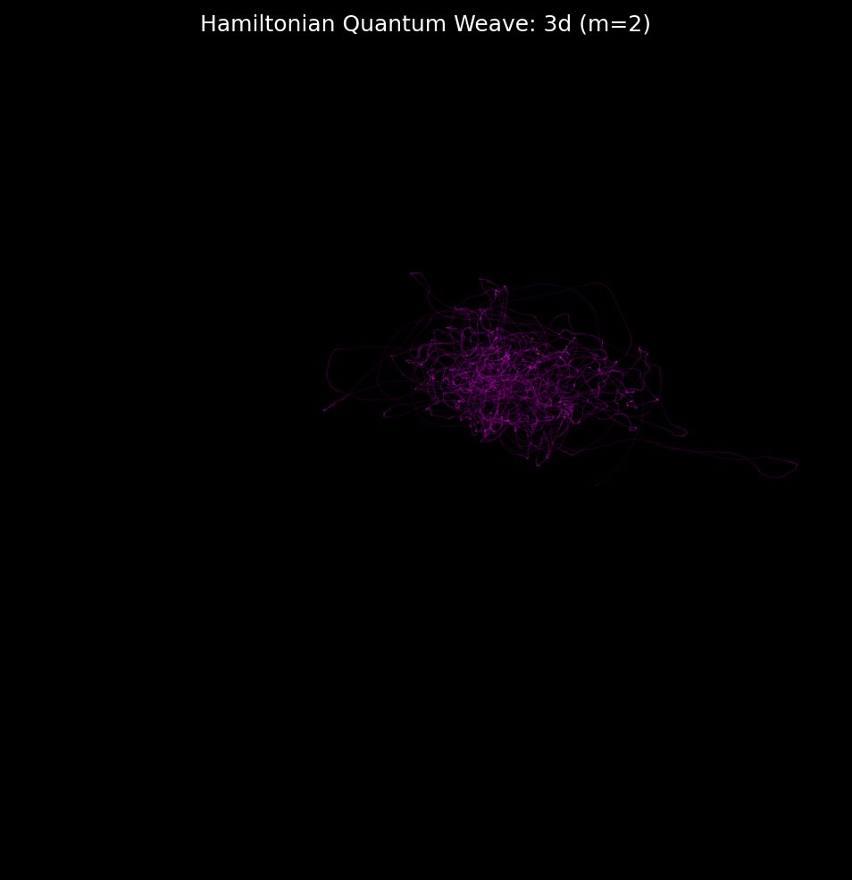
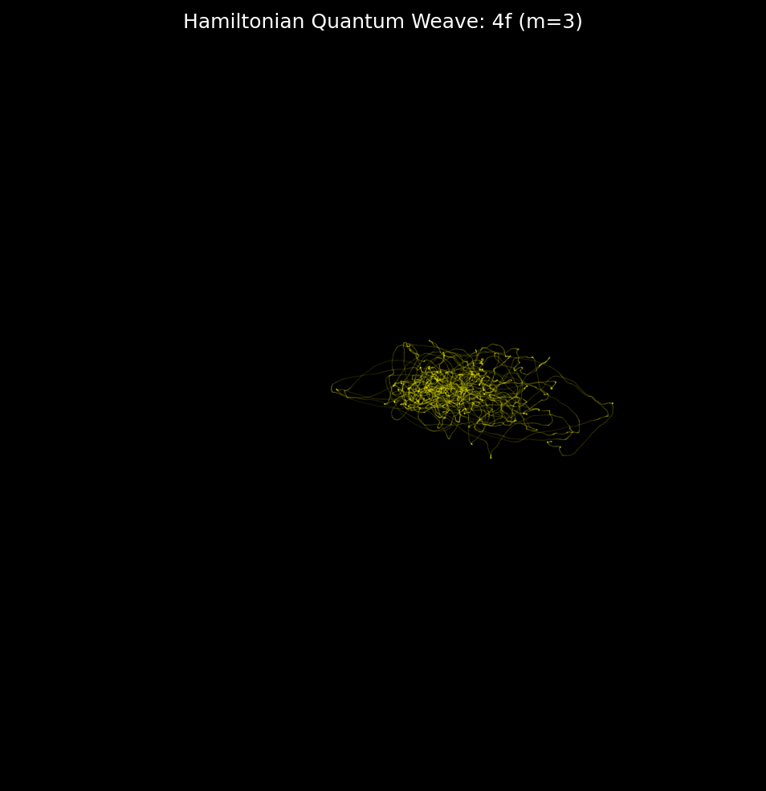

# Hamiltonian Framework: Energetic Orbital Simulations

This report validates the continuous mapping of the Hamiltonian Quantum Potential framework against classical Schrödinger probability clouds.

Rather than using discrete jumps or Monte Carlo probability sampling, these 3D volumes are generated by a **single continuous 1D trajectory**. The particle is mathematically 'steered' down the gradients of the Quantum Potential field using an Energetic Integration over 100,000 timesteps ($dt=0.01$).
A stochastic Langevin thermostat ensures the particle explores the *full volume course* rather than settling into a resonant ring.

### Simulation Data
- **Integration Method**: Hamiltonian Kinematics with Langevin Thermostat
- **Time Steps**: 100,000
- **Forces ($F_x, F_y, F_z$)**: Quantum Potential Gradients ($Q \propto -\nabla^2 R / R$) + Stochastic Kick

## Orbital Cloud Density Maps

| Orbital | Quantum State ($n, l, m$) | Deterministic Time-Lapse |
| :--- | :--- | :--- |
| 1s | $n=1, l=0, m=0$ |  |
| 2p (m=1) | $n=2, l=1, m=1$ |  |
| 3d (m=2) | $n=3, l=2, m=2$ |  |
| 4f (m=3) | $n=4, l=3, m=3$ |  |
